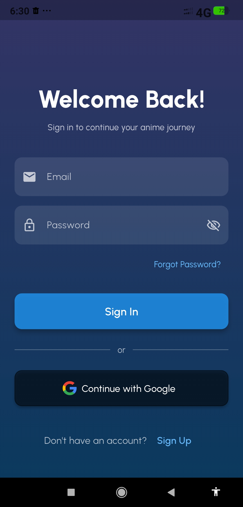
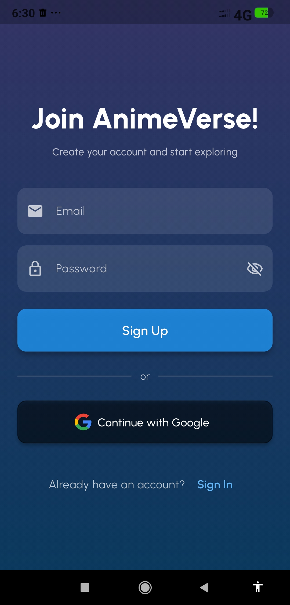
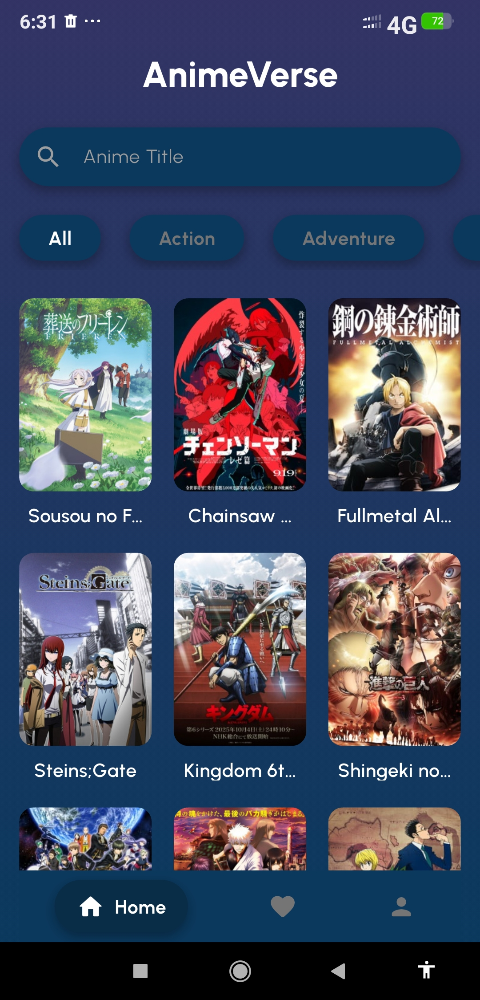
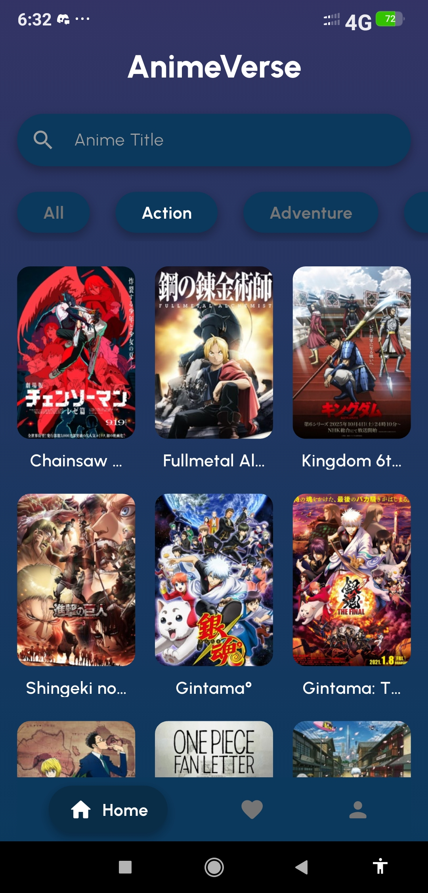
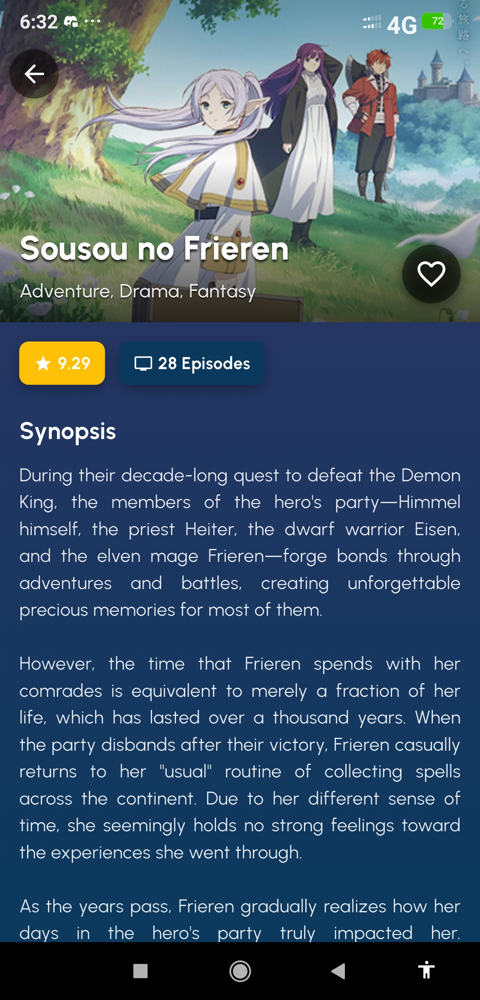
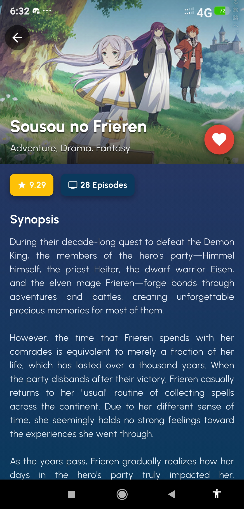
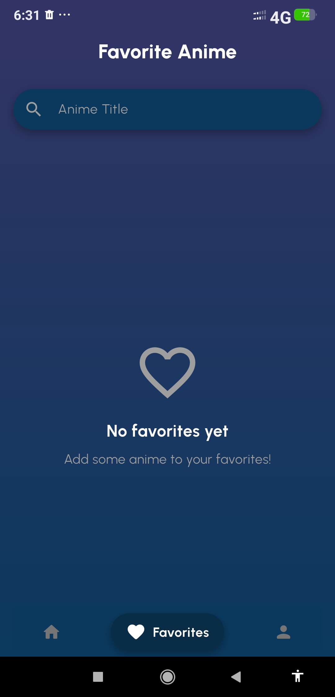
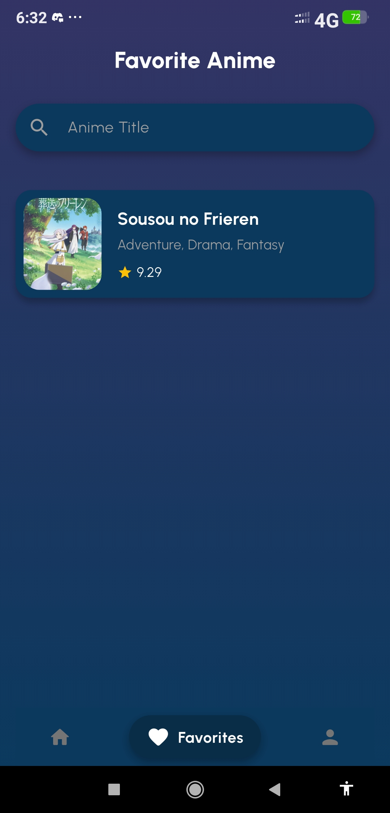
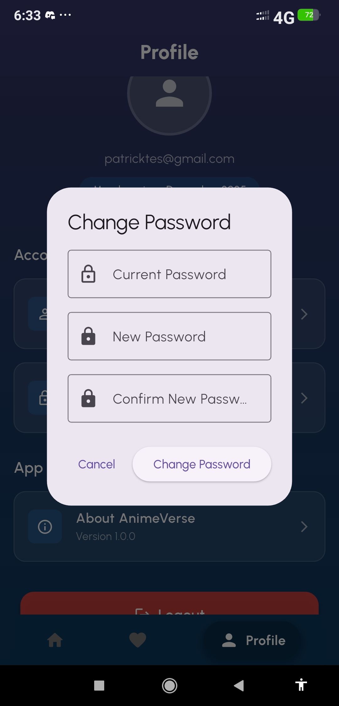
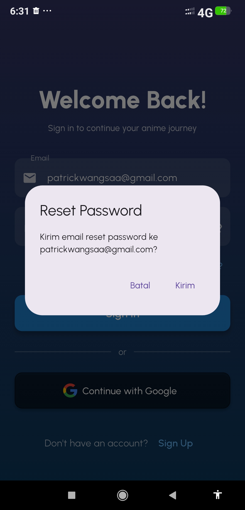

# ANIME VERSE

Submission Proyek Akhir Pemrograman Mobile Semester Ganjil T.A. 2025/2026.

## Identitas Mahasiswa

- **Nama:** Patrick Nathan Wangsa
- **NIM:** 231401071
- **Kelas:** KOM-B
- **Asisten Lab:** Rivaldo Dominggos Pardede (RDP)

## Deskripsi Proyek

Anime Verse adalah aplikasi mobile berbasis Flutter yang memungkinkan pengguna untuk menjelajahi dunia anime. Aplikasi ini menyediakan fitur untuk mencari, melihat detail, dan menyimpan anime favorit. Pengguna dapat mendaftar dan masuk menggunakan email & password atau akun Google. Proyek ini dibuat sebagai tugas akhir untuk mata kuliah Pemrograman Mobile di Program Studi Ilmu Komputer, Fasilkom-TI, Universitas Sumatera Utara.

## Screenshot Aplikasi

Berikut adalah Screenshot dari semua layar yang ada di aplikasi Anime Verse.

| Splash Screen | Halaman Sign In | Halaman Sign Up |
| :---: | :---: | :---: |
|  |  |  |

| Halaman Beranda | Halaman Beranda (Filter) | Halaman Detail Anime |
| :---: | :---: | :---: |
|  |  |  |

| Detail Anime (Favorit) | Halaman Favorit (Kosong) | Halaman Favorit (Isi) |
| :---: | :---: | :---: |
|  |  |  |

| Halaman Profil | Ganti Password | Lupa Password |
| :---: | :---: | :---: |
|  |  |  |

## Link Demo Aplikasi

Tonton video demo aplikasi di bawah ini untuk melihat semua fitur utama dalam aksi.

**[Tonton Demo di YouTube](https://link.ke.video.demo.anda)**
